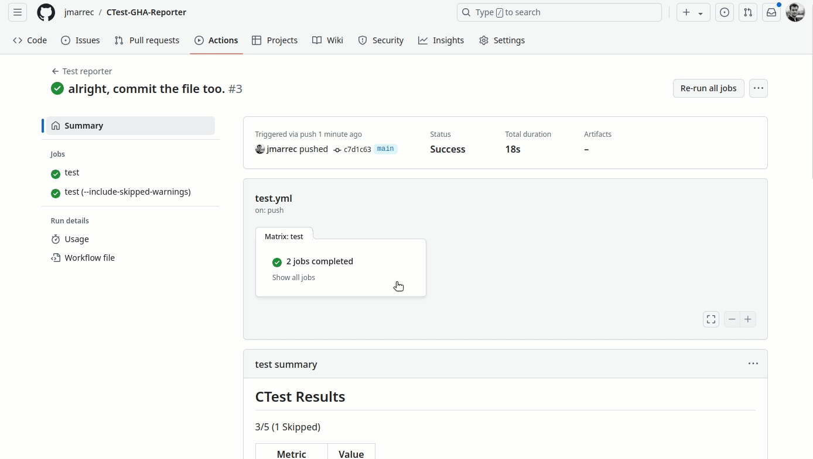

# Create a Github Actions Step Summary and Annotations from CTest JUnit

run `ctest` with `--output-junit ctest.xml`

```
usage: ctest_junit_parser.py [-h] [-i] ctest_xml

Parse CTest JUnit XML and Generate a report.

positional arguments:
  ctest_xml             The JUnit xml filepath. Run `ctest --output-junit ctest.xml`

optional arguments:
  -h, --help            show this help message and exit
  -i, --include-skipped-warnings
                        Include Skipped Warnings Annotations
```


